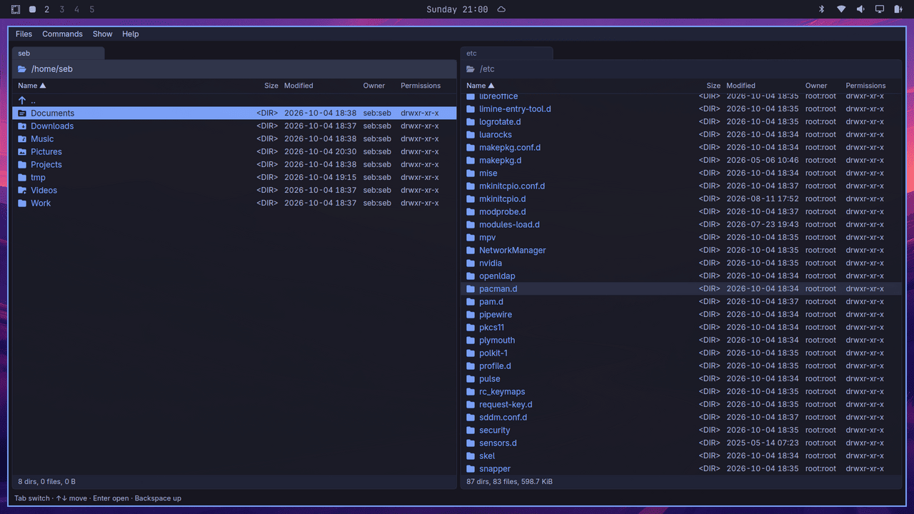

# yagni-commander

<p align="center">
  <br>
  <em>yagni-commander on Omarchy</em>
</p>

A YAGNI-minded, keyboard-first, dual-pane file manager for macOS and Linux. It does the part of a classic commander that I actually use, not all of it ("you aren't gonna need it"). Written in Rust with [gpui](https://github.com/zed-industries/zed/tree/main/crates/gpui), the UI framework behind the Zed editor.

More than a little inspired by these GOATs:

- [DOS Navigator](https://en.wikipedia.org/wiki/DOS_Navigator)
- [Total Commander](https://en.wikipedia.org/wiki/Total_Commander)
- [Double Commander](https://en.wikipedia.org/wiki/Double_Commander)

and of course the OG, [Norton Commander](https://en.wikipedia.org/wiki/Norton_Commander).

Aimed at macOS, KDE Plasma and Hyprland (Omarchy). Tested on macOS, KDE (X11 and Wayland) and Omarchy (Hyprland). Early days.

A personal project. Bug reports are welcome; feature requests will mostly get a YAGNI.

## Features

- Two panels, Tab switches between them. Columns Name, Size, Modified, Owner, Permissions; click a header to sort.
- File icons by name and extension (like `eza --icons`), from a bundled Nerd Font.
- Total Commander keys: F3 view, F4 edit (in your editor), F5 copy, F6 move, F7 new folder, F8 trash, Shift-F8 delete, F2 rename, Shift-F4 new file, Alt-Z, Ctrl-U, Ctrl-R. The full keymap is in [SPEC.md](SPEC.md#keyboard). Keys can't be remapped in the app, so a key your desktop takes for itself never arrives: free it in the desktop's shortcut settings. Some KDE Plasma versions bind Alt-F7 (find files) to Move Window; Commands > Find files... works either way.
- Copy, move and delete run in the background with progress, Cancel and a prompt per conflict.
- Type to jump: a quick search box finds names starting with what you type.
- A viewer (F3) that opens multi-GB files instantly.
- Help > Check for updates (on macOS in the app menu): asks GitHub only when you choose it.
- Panels follow changes made by other programs.
- Hidden files on Ctrl-., folders and window position remembered between runs.
- Five themes (Tokyo Night, Gruvbox Dark, Everforest Dark, Catppuccin Latte, Classic), switched live in the settings dialog (Ctrl-,), and a plain TOML config file; an optional log of every file operation.

## Installing

On macOS (Apple Silicon and Intel) and Linux (x86_64):

```sh
curl -fsSL https://github.com/sebbarg/yagni-commander/releases/latest/download/install.sh | sh
```

It downloads the latest release, checks it against the release's `SHA256SUMS`, and installs it for you alone, no root needed: on macOS `yagni-commander.app` in `~/Applications`, on Linux the binary, a launcher entry and the icons in `~/.local`, so it shows in your app menu. Run it again to update. It needs `curl` (Ubuntu 22.04 lacks it: `sudo apt install curl`). To remove it: `... | sh -s -- --uninstall`. The script is short; download it and read it first if you prefer.

### By hand

Download the file for your system from [Releases](https://github.com/sebbarg/yagni-commander/releases), or build it yourself (below).

**macOS** (`yagni-commander-<version>-macos.zip`): unzip it and move `yagni-commander.app` to Applications. The app is not notarized by Apple (that needs a paid developer account), so macOS refuses to open a copy downloaded with a browser. Remove the download mark once:

```sh
xattr -dr com.apple.quarantine /Applications/yagni-commander.app
```

or try to open it, then choose Open Anyway in System Settings > Privacy & Security. The install script and a build from source don't need this step.

**Linux** (`yagni-commander-<version>-linux-x86_64.tar.gz`, built on Ubuntu 22.04, so it needs glibc 2.35 or newer):

```sh
tar -xzf yagni-commander-*-linux-x86_64.tar.gz
cd yagni-commander-*-linux-x86_64
./install.sh
```

`./install.sh uninstall` removes it.

**Without a GPU** (a virtual machine, or no working graphics driver), it renders through Mesa's software Vulkan driver (llvmpipe). Ubuntu 22.04's Mesa (23.2) draws an empty window there: the frame shows, the inside stays see-through. Newer Mesa works (Ubuntu 24.04's does); on 22.04 install it from the kisak PPA:

```sh
sudo add-apt-repository ppa:kisak/kisak-mesa
sudo apt update && sudo apt upgrade
```

The newest Mesa has the opposite problem for now: built with LLVM 22 (Fedora 44, current Arch), llvmpipe crashes compiling a shader ("LLVM ERROR: Cannot select ... X86ISD::MGATHER"), an upstream Mesa/LLVM bug that also hits other apps. With a GPU, none of this applies.

## Building

Install Rust with [rustup](https://rustup.rs/) (1.95 or newer; an older one stops with "requires rustc 1.95", fixed by `rustup update stable`), then the system packages:

- **macOS:** Xcode.
- **Kubuntu / Debian:** `sudo apt install build-essential pkg-config clang cmake libxkbcommon-dev libxkbcommon-x11-dev libwayland-dev libfontconfig-dev libfreetype-dev libx11-dev libx11-xcb-dev libxcb1-dev libvulkan-dev`
- **Arch / Omarchy:** `sudo pacman -S --needed base-devel clang cmake libxkbcommon libxkbcommon-x11 wayland fontconfig freetype2 libx11 libxcb vulkan-icd-loader`, plus the Vulkan driver for your GPU.

Then:

```sh
cargo run --release -- [left-folder] [right-folder]
```

Without folders it reopens the ones from the last run.

To install your build as an app with its icon:

- **Linux:** `scripts/install-linux.sh` puts the binary in `~/.local/bin`, plus a launcher entry and icons under `~/.local/share`, so it shows in the app menu. `scripts/install-linux.sh uninstall` removes them.
- **macOS:** `scripts/bundle-mac.sh` builds `yagni-commander.app` and copies it to `~/Applications`, where Finder, Launchpad and Spotlight find it.

## Configuration

The settings dialog (Ctrl-,) edits a TOML file you can also edit by hand; Ctrl-R re-reads it. Help > Go to config file shows it in the active panel, ready for F4.

- Linux: `~/.config/yagni-commander/config.toml`
- macOS: `~/Library/Application Support/yagni-commander/config.toml`

Set `editor` to the command F4 runs, for example `editor = "code --wait"`.

Set `theme` to `tokyo-night` (the default), `gruvbox-dark`, `everforest-dark`, `catppuccin-latte` (light) or `classic` (light), or pick one in the settings dialog; it switches at once.

## Development

`cargo test --workspace`, `cargo clippy --workspace --all-targets` and, on Linux, `scripts/smoke.sh`, which drives the real app under Xvfb. It needs `sudo apt install xvfb xdotool x11-utils imagemagick xclip mesa-vulkan-drivers` (Kubuntu) or `sudo pacman -S xorg-server-xvfb xdotool xorg-xprop imagemagick xclip vulkan-swrast` (Arch).

- [SPEC.md](SPEC.md): what the app does, and why.
- [ARCHITECTURE.md](ARCHITECTURE.md): how the code is organized, technical decisions, known issues.
- [ROADMAP.md](ROADMAP.md): what comes next.
- [CLAUDE.md](CLAUDE.md): how we work on it (with Claude Code).

### Releasing

The version lives in one place, `version` under `[workspace.package]` in the root `Cargo.toml`. Push your work first: the script runs only on a clean `main` that matches `origin/main`.

```sh
git push
scripts/release.sh 1.1.0    # asks once, then sets the version, updates Cargo.lock, runs the tests, commits, tags v1.1.0 and pushes
```

The script asks for confirmation before the slow part, then runs to the end on its own. It pushes the release commit and the tag with `git push --atomic origin main v1.1.0`: both or neither, so a release is never built from a commit that isn't on `main`. The tag starts the release workflow. If the push fails, the commit and tag stay local and the script prints that command to retry.

The workflow builds the macOS zip and the Linux tarball and uploads them, with `install.sh` and `SHA256SUMS`, as a draft release. Try the files, then publish the draft on the Releases page (`gh release edit v1.1.0 --draft=false`); only then does `releases/latest` serve it.

If the workflow fails: fix it, delete the draft (if one was made) and the tag, and tag the fixed commit again:

```sh
git push origin :v1.1.0 && git tag -d v1.1.0
git tag -a v1.1.0 -m v1.1.0 && git push origin v1.1.0
```

Version numbers: the major number for changes that break habits or files (keys, config, state), the minor number for new features, the patch number for fixes only.

## License

MIT, see [LICENSE](LICENSE). Bundled third-party material (the icon font, the icon table and JetBrains Mono) is listed in [THIRD-PARTY-NOTICES.md](THIRD-PARTY-NOTICES.md).
